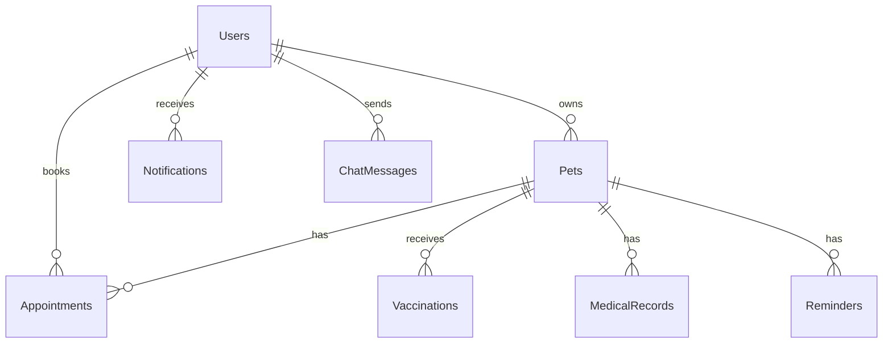

# 🐾 Little Tails - Veterinary Clinic Management System

A full-stack, production-ready veterinary clinic management web application built with modern technologies.


## ✨ Features

### 🌐 Public Website
- Responsive landing page with hero, about, services, contact, and footer sections
- Modern design with smooth animations, gradient mesh backgrounds, and floating elements
- Dark/light mode toggle
- Embedded Google Maps location
- Contact form

### 🔐 Authentication System
- User registration and login with JWT tokens
- Secure password hashing (bcryptjs)
- Role-based access control (User / Admin)
- Protected routes via Next.js middleware
- HTTP-only cookie-based session management

### 👤 User Dashboard
- **Pet Management**: Add, edit, and delete pet profiles with full details
  - Pet name, species, breed, age, weight, gender, color
  - Vaccination history and medical records
  - Allergies and complications tracking
  - Registration numbers
- **Appointment Booking**: Book appointments for any registered pet
  - Service selection (Vaccination, Grooming, Nutrition, Medicine, Checkup)
  - Date and time picker
  - Status tracking (Pending, Approved, Rejected, Completed, Cancelled)
  - Cancel functionality
- **Reminders & Notifications**: Vaccination, health checkup, and medication reminders
- **AI Pet Assistant**: 24/7 AI chatbot for pet health guidance
  - Quick question suggestions
  - Chat history persistence
  - OpenAI/Gemini API integration with intelligent fallback

### 🛡️ Admin Dashboard
- **Dashboard Analytics**: Stats cards, recent appointments, new user tracking
- **Appointment Management**: Approve, reject, reschedule, complete appointments with admin notes
- **Pet Registry**: Search all pets by registration number, name, breed, owner phone/email
- **User Management**: View all users with pagination, search, activity status
- **Medicine Inventory**: Full CRUD for medicine stock with low stock alerts, category tracking, value calculation

### 💊 Medicine Stock Management
- Add, edit, delete medicines
- Track stock levels with minimum stock alerts
- Expiry date monitoring
- Category organization
- Total inventory value calculation

### 🔔 Reminder System
- Vaccination reminders
- Appointment reminders
- Health checkup notifications
- In-app notification system
- Email/SMS ready (SMTP + Twilio configured)

### 🤖 AI Integration
- OpenAI GPT-3.5/GPT-4 support
- Google Gemini API support
- Intelligent fallback responses (works without API keys)
- Pet health FAQ, nutrition, grooming, vaccination guidance
- Chat history persistence

## 🛠️ Tech Stack

| Layer | Technology |
|-------|-----------|
| Frontend | Next.js 15, React 19, TypeScript |
| Styling | Tailwind CSS 4, Custom CSS Variables |
| Database | PostgreSQL + Prisma ORM |
| Authentication | JWT (jose), bcryptjs, HTTP-only Cookies |
| API | Next.js API Routes (App Router) |
| AI | OpenAI / Google Gemini API |
| Email | Nodemailer (SMTP) |
| UI Icons | Lucide React |
| Notifications | React Hot Toast |
| Validation | Zod |

## 📁 Project Structure

```
little-tails/
├── prisma/
│   ├── schema.prisma          # Database schema
│   └── seed.ts                # Sample data seeder
├── src/
│   ├── app/
│   │   ├── api/               # API Routes
│   │   │   ├── auth/          # Login, Register, Logout, Me
│   │   │   ├── pets/          # Pet CRUD
│   │   │   ├── appointments/  # Appointment CRUD
│   │   │   ├── notifications/ # Notifications API
│   │   │   ├── admin/         # Admin APIs (stats, users, pets, medicine)
│   │   │   └── ai/            # AI Chat API
│   │   ├── dashboard/         # User Dashboard Pages
│   │   │   ├── pets/
│   │   │   ├── appointments/
│   │   │   ├── reminders/
│   │   │   └── ai-assistant/
│   │   ├── admin/             # Admin Dashboard Pages
│   │   │   ├── appointments/
│   │   │   ├── pets/
│   │   │   ├── users/
│   │   │   └── medicine/
│   │   ├── login/
│   │   ├── register/
│   │   ├── layout.tsx         # Root layout
│   │   ├── page.tsx           # Landing page
│   │   └── globals.css        # Global styles
│   ├── components/
│   │   ├── ui/                # Reusable UI components
│   │   │   ├── Button.tsx
│   │   │   ├── Card.tsx
│   │   │   ├── Input.tsx
│   │   │   ├── Modal.tsx
│   │   │   └── LoadingSpinner.tsx
│   │   └── landing/           # Landing page components
│   │       ├── Navbar.tsx
│   │       ├── Hero.tsx
│   │       ├── About.tsx
│   │       ├── Services.tsx
│   │       ├── Contact.tsx
│   │       └── Footer.tsx
│   ├── context/
│   │   ├── AuthContext.tsx    # Authentication context
│   │   └── ThemeContext.tsx   # Dark/light mode context
│   ├── lib/
│   │   ├── auth.ts           # Auth utilities
│   │   ├── prisma.ts         # Prisma client singleton
│   │   ├── utils.ts          # Utility functions
│   │   └── validators.ts     # Zod schemas
│   └── middleware.ts          # Route protection
├── .env                       # Environment variables
├── .env.example               # Environment template
├── package.json
├── tsconfig.json
└── README.md
```

## 🚀 Getting Started

### Prerequisites

- **Node.js** 18+ 
- **PostgreSQL** 15+ (running locally or cloud service)
- **npm** or **yarn**

### Installation

1. **Clone the repository**
   ```bash
   git clone <repository-url>
   cd little-tails
   ```

2. **Install dependencies**
   ```bash
   npm install
   ```

3. **Configure environment variables**
   ```bash
   cp .env.example .env
   ```
   Edit `.env` and update:
   - `DATABASE_URL` - Your PostgreSQL connection string
   - `JWT_SECRET` - A secure random string
   - `OPENAI_API_KEY` or `GEMINI_API_KEY` (optional, for AI features)
   - SMTP credentials (optional, for email reminders)

4. **Set up the database**
   ```bash
   # Generate Prisma client
   npx prisma generate
   
   # Push schema to database
   npx prisma db push
   
   # Seed with sample data
   npm run db:seed
   ```

5. **Start the development server**
   ```bash
   npm run dev
   ```

6. **Open your browser**
   Navigate to [http://localhost:3000](http://localhost:3000)

### Demo Credentials

| Role | Email | Password |
|------|-------|----------|
| Admin | admin@littletails.com | admin123 |
| User | user@littletails.com | password123 |
| User | jane@example.com | password123 |
| User | mike@example.com | password123 |

## 📊 Database Schema



### Models
- **User** - Authentication, profile, role management
- **Pet** - Pet profiles with registration numbers
- **Appointment** - Booking with status workflow
- **Vaccination** - Vaccination records with due dates
- **MedicalRecord** - Diagnosis, treatment, prescriptions
- **Medicine** - Inventory with stock management
- **Notification** - In-app notifications
- **Reminder** - Scheduled health reminders
- **ChatMessage** - AI chat history

## 🔑 API Documentation

### Authentication
| Method | Endpoint | Description |
|--------|----------|-------------|
| POST | `/api/auth/register` | Register new user |
| POST | `/api/auth/login` | User login |
| POST | `/api/auth/logout` | User logout |
| GET | `/api/auth/me` | Get current user |

### Pets
| Method | Endpoint | Description |
|--------|----------|-------------|
| GET | `/api/pets` | List user's pets |
| POST | `/api/pets` | Create pet |
| GET | `/api/pets/:id` | Get pet details |
| PUT | `/api/pets/:id` | Update pet |
| DELETE | `/api/pets/:id` | Delete pet (soft) |

### Appointments
| Method | Endpoint | Description |
|--------|----------|-------------|
| GET | `/api/appointments` | List appointments |
| POST | `/api/appointments` | Book appointment |
| PATCH | `/api/appointments/:id` | Update status |

### Notifications
| Method | Endpoint | Description |
|--------|----------|-------------|
| GET | `/api/notifications` | Get notifications |
| PATCH | `/api/notifications` | Mark all as read |

### AI Chat
| Method | Endpoint | Description |
|--------|----------|-------------|
| GET | `/api/ai/chat` | Get chat history |
| POST | `/api/ai/chat` | Send message |

### Admin APIs
| Method | Endpoint | Description |
|--------|----------|-------------|
| GET | `/api/admin/stats` | Dashboard statistics |
| GET | `/api/admin/users` | List all users |
| GET | `/api/admin/pets` | Search all pets |
| GET | `/api/admin/medicine` | List medicine stock |
| POST | `/api/admin/medicine` | Add medicine |
| PUT | `/api/admin/medicine/:id` | Update medicine |
| DELETE | `/api/admin/medicine/:id` | Delete medicine |

## 🎨 UI Theme

The application uses a custom design system with:
- **Primary**: `#6C63FF` (Indigo purple)
- **Secondary**: `#FF6B9D` (Coral pink)
- **Accent**: `#00D4AA` (Teal green)
- **Warm**: `#FFB347` (Amber)
- **Typography**: Inter (body) + Fredoka (headings)
- **Design**: Soft colors, rounded cards, smooth animations, glass morphism

## 🚢 Deployment

### Vercel (Recommended)
1. Push to GitHub
2. Import in [Vercel](https://vercel.com)
3. Add environment variables
4. Deploy

### Docker
```dockerfile
FROM node:18-alpine
WORKDIR /app
COPY package*.json ./
RUN npm ci
COPY . .
RUN npx prisma generate
RUN npm run build
EXPOSE 3000
CMD ["npm", "start"]
```

### Production Checklist
- [ ] Set strong `JWT_SECRET`
- [ ] Configure production `DATABASE_URL`
- [ ] Set `NODE_ENV=production`
- [ ] Configure email SMTP credentials
- [ ] Add AI API keys (OpenAI/Gemini)
- [ ] Set up SSL/TLS
- [ ] Configure CORS if needed

## 📜 Available Scripts

```bash
npm run dev          # Start dev server
npm run build        # Build for production
npm run start        # Start production server
npm run lint         # Run ESLint
npm run db:migrate   # Run Prisma migrations
npm run db:push      # Push schema to database
npm run db:seed      # Seed database
npm run db:studio    # Open Prisma Studio
npm run db:generate  # Generate Prisma client
```

## 📄 License

This project is licensed under the MIT License.

---

Built with ❤️ for pets everywhere 🐾
